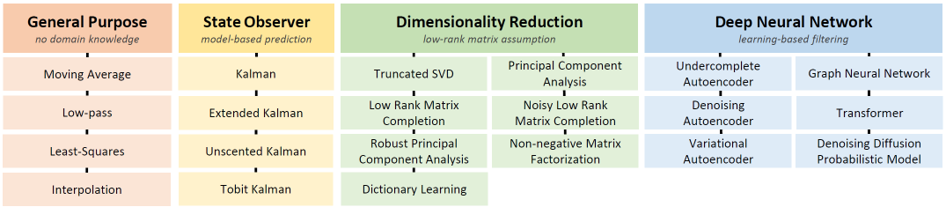

# mocap-refinement

[](https://forthebadge.com)

This repository includes implementation codes of filtering methods for denoising and completing data generated by software platforms for human motion analysis, allowing readers to easily reproduce all the algorithms in different experimental settings.



## Usage
To run a simple filter from the main directory:
```
python3 filters/<filter_name>.py <filter_name> <input_file_path> <output_directory_path> <delta_t> <model>
```
To check the error of the filtered file, run:
```
python3 utils/checker.py --ref <ground_truth_directory_path> --source <input_directory_path> -out <stats_file_path>
```

For example, to run and evaluate the error the Butterworth Filter (BF):
```
python3 filters/BF.py BF data/input/S9_Discussion.csv data/output/ 20
python3 utils/checker.py --ref data/gt --source data/output/BF --out data/stats/BF.csv
```
This will create a new directory "data/output/BF" and store the refined results.

To have a reference of the input error, run:
```
python3 utils/checker.py --ref data/gt --source data/input --out data/stats/input.csv
```

## Data format
For the data format, please follow the example file in the "data" folder.

## Training 
Some filters may require a training phase. 
To preprare the train and validation datasets, follow the code in "utils/prepare_data.py".
For the training phase, follow the Jupyther Notebook "utils/train.ipynb".

## Accuracy Results on Human3.6M

<table border="1" class="dataframe">  <thead>    <tr style="text-align: center;">      <th>Category</th>      <th>Method</th>      <th>MPJPE Low error jitter</th>      <th>Accel Low error jitter</th>      <th>MPJPE High error jitter</th>      <th>Accel High error jitter</th>      <th>MPJPE Missing keypoints</th>      <th>Accel Missing keypoints</th>      <th>MPJPE Missing keypoints with error</th>      <th>Accel Missing keypoints with error</th>    </tr>  </thead>  <tbody>    <tr>      <td></td>      <td>Baseline</td>      <td>96.1</td>      <td>230.0</td>      <td>146.3</td>      <td>381.9</td>      <td>-</td>      <td>-</td>      <td>-</td>      <td>-</td>    </tr>    <tr>      <td>General Purpose</td>      <td>Simple Moving Average</td>      <td>74.6</td>      <td>11.5</td>      <td>85.0</td>      <td>19.7</td>      <td>-</td>      <td>-</td>      <td>-</td>      <td>-</td>    </tr>    <tr>      <td>General Purpose</td>      <td>Weighted Moving Average</td>      <td>76.8</td>      <td>4.4</td>      <td>88.7</td>      <td>7.0</td>      <td>-</td>      <td>-</td>      <td>-</td>      <td>-</td>    </tr>    <tr>      <td>General Purpose</td>      <td>Exponential Moving Average</td>      <td>55.4</td>      <td>85.8</td>      <td>89.6</td>      <td>140.8</td>      <td>-</td>      <td>-</td>      <td>-</td>      <td>-</td>    </tr>    <tr>      <td>General Purpose</td>      <td>HDE</td>      <td>63.0</td>      <td>92.3</td>      <td>102.6</td>      <td>151.4</td>      <td>-</td>      <td>-</td>      <td>-</td>      <td>-</td>    </tr>    <tr>      <td>General Purpose</td>      <td>Butterworth</td>      <td>24.8</td>      <td>3.0</td>      <td>41.5</td>      <td>5.0</td>      <td>-</td>      <td>-</td>      <td>-</td>      <td>-</td>    </tr>    <tr>      <td>General Purpose</td>      <td>Savitzky–Golay</td>      <td>63.3</td>      <td>116.7</td>      <td>102.1</td>      <td>194.5</td>      <td>-</td>      <td>-</td>      <td>-</td>      <td>-</td>    </tr>    <tr>      <td>General Purpose</td>      <td>Interpolation</td>      <td>-</td>      <td>-</td>      <td>-</td>      <td>-</td>      <td>0.3</td>      <td>1.1</td>      <td>244.8</td>      <td>634.0</td>    </tr>    <tr>      <td>General Purpose</td>      <td>Least Squares Gaussian</td>      <td>62.7</td>      <td>17.2</td>      <td>78.4</td>      <td>19.4</td>      <td>-</td>      <td>-</td>      <td>-</td>      <td>-</td>    </tr>    <tr>      <td>State Observer</td>      <td>Kalman Filter (0th)</td>      <td>46.4</td>      <td>29.4</td>      <td>66.0</td>      <td>48.3</td>      <td>30.1</td>      <td>2.8</td>      <td>48.7</td>      <td>29.6</td>    </tr>    <tr>      <td>State Observer</td>      <td>Kalman Filter (1st)</td>      <td>42.3</td>      <td>33.0</td>      <td>65.9</td>      <td>54.2</td>      <td>21.4</td>      <td>2.4</td>      <td>44.2</td>      <td>33.2</td>    </tr>    <tr>      <td>State Observer</td>      <td>Kalman Filter (2nd)</td>      <td>43.1</td>      <td>35.7</td>      <td>68.8</td>      <td>58.7</td>      <td>19.0</td>      <td>2.4</td>      <td>45.0</td>      <td>36.0</td>    </tr>    <tr>      <td>Dimensionality Reduction</td>      <td>Truncated Singular Value Decomposition</td>      <td>64.0</td>      <td>143.7</td>      <td>98.3</td>      <td>226.6</td>      <td>-</td>      <td>-</td>      <td>-</td>      <td>-</td>    </tr>    <tr>      <td>Dimensionality Reduction</td>      <td>Low-Rank Matrix Completion</td>      <td>-</td>      <td>-</td>      <td>-</td>      <td>-</td>      <td>4.9</td>      <td>16.7</td>      <td>92.5</td>      <td>219.7</td>    </tr>    <tr>      <td>Dimensionality Reduction</td>      <td>Noisy Low-Rank Matrix Completion</td>      <td>-</td>      <td>-</td>      <td>-</td>      <td>-</td>      <td>32.3</td>      <td>109.4</td>      <td>111.1</td>      <td>267.8</td>    </tr>    <tr>      <td>Dimensionality Reduction</td>      <td>Robust Principal Component Analysis</td>      <td>79.8</td>      <td>182.0</td>      <td>90.2</td>      <td>207.7</td>      <td>-</td>      <td>-</td>      <td>-</td>      <td>-</td>    </tr>    <tr>      <td>Deep Neural Network</td>      <td>Undercomplete Autoencoder</td>      <td>83.6</td>      <td>197.7</td>      <td>128.0</td>      <td>331.0</td>      <td>-</td>      <td>-</td>      <td>-</td>      <td>-</td>    </tr>    <tr>      <td>Deep Neural Network</td>      <td>Undercomplete Denoising Autoencoder</td>      <td>59.5</td>      <td>89.5</td>      <td>92.0</td>      <td>75.6</td>      <td>-</td>      <td>-</td>      <td>-</td>      <td>-</td>    </tr>    <tr>      <td>Deep Neural Network</td>      <td>Recurrent Neural Network Autoencoder</td>      <td>89.5</td>      <td>34.8</td>      <td>136.2</td>      <td>40.8</td>      <td>-</td>      <td>-</td>      <td>-</td>      <td>-</td>    </tr>    <tr>      <td>Hybrids</td>      <td>KF+DE</td>      <td>76.9</td>      <td>102.2</td>      <td>138.0</td>      <td>174.3</td>      <td>-</td>      <td>-</td>      <td>-</td>      <td>-</td>    </tr>  </tbody></table>

## Citation
```
@article{martini2025denoising,
  title={Denoising and completion filters for human motion software: A survey with code},
  author={Martini, Enrico and Calanca, Andrea and Bombieri, Nicola},
  journal={Computer Science Review},
  volume={58},
  pages={100780},
  year={2025},
  publisher={Elsevier}
}
```